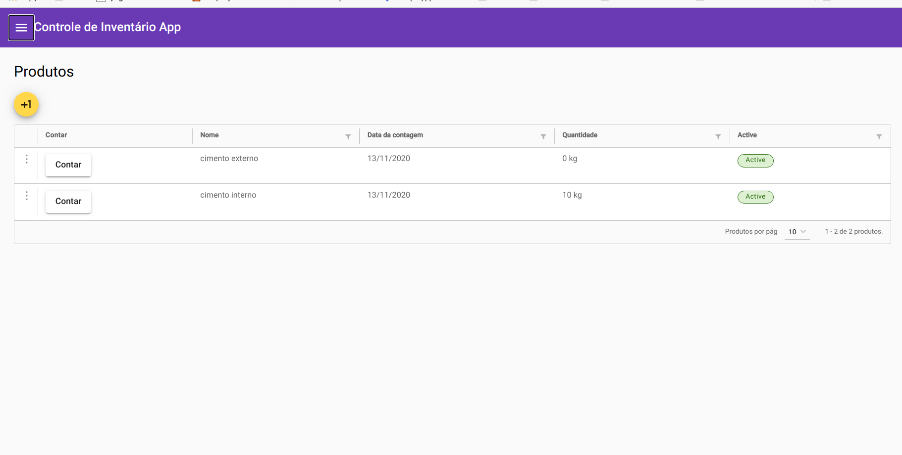
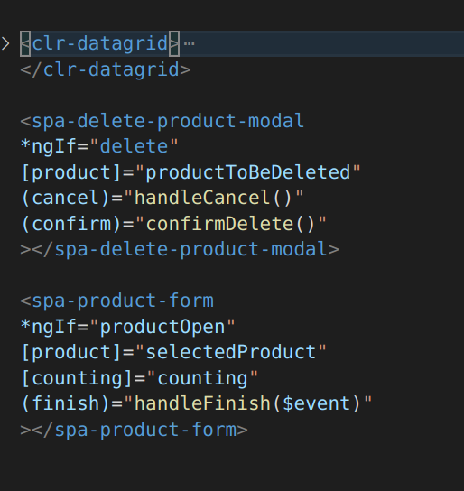
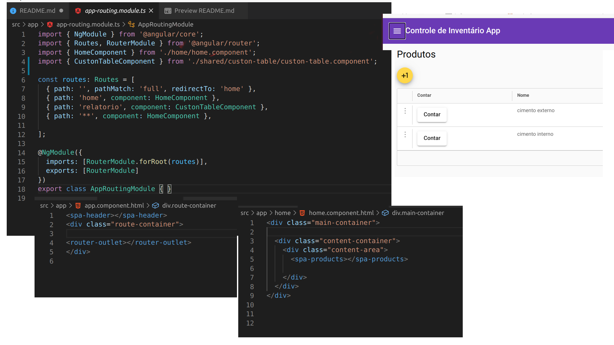
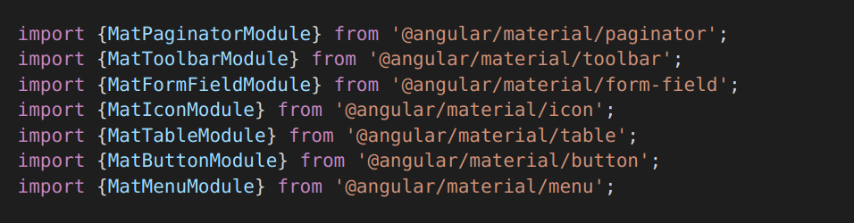
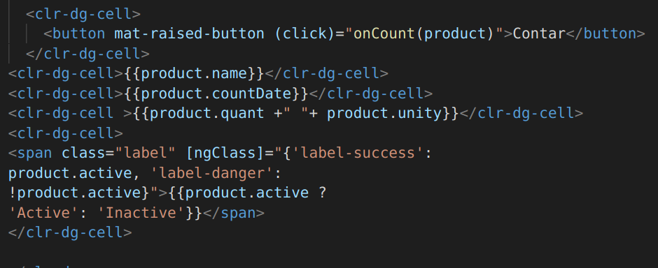
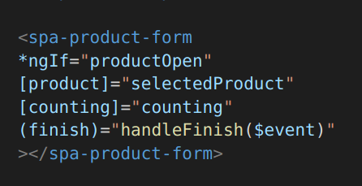
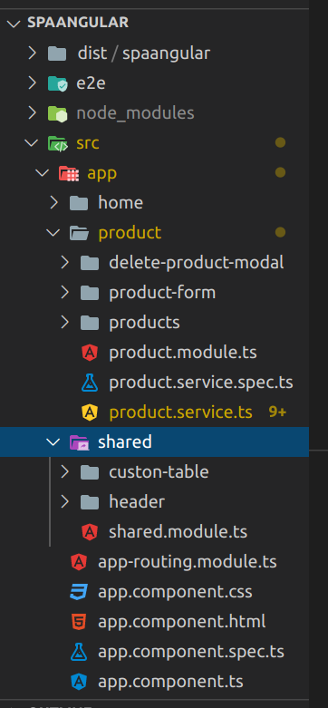

# SPA Angular

SPA desenvolvida com Angular 10 como cumprimento parcial do Bootcamp Aceleração Global2 da Avanade e DIO. Desafio solicitado pela Camila Ribeiro.

O objetivo deste SPA foi atender ao desafio do Bootcamp citado, com os seguintes requistos:

1) Crie uma aplicação Angular (Não esqueça que todo código precisa estar no GitHub)
2) Crie no mínimo 3 componentes que deverão estar interagindo na mesma página (Não esqueça das rotas)
3) Escolha no mínimo 4 componentes do Angular Material e incorpore eles em sua aplicação.
4) Crie em uma das páginas uma interação através da Interpolação e/ou utilizando Property Biding.
5) Crie uma explicação sobre o que foi feito, esta explicação será inserida na plataforma junto com o link para o código no GitHub.
6) Você poderá criar um vídeo demonstrativo da aplicação construída, e publicá-lo no YouTube, passando o link de acesso na plataforma. Este passo 6, não é obrigatório, mas entrará como um diferencial.

## Para testar a aplicação clique aqui => : [https://spa.com.br](https://wonderful-island-05f434810.azurestaticapps.net)

Abaixo descrevo os ítens atendidos:

## 1) Crie uma aplicação Angular (Não esqueça que todo código precisa estar no GitHub):

A aplicação criada foi feita não pensando apenas no desafio, mas como um protótipo inicial de um projeto pessoal solicitado por um colega a pouco tempo atrás. O mesmo falou sobre a necessidade de melhorar os processos de inventário da empresa em que trabalha, sendo assim a aplicação segue de acordo a alguns requisitos sitados por ele.

Tela Principal:

## 2) Crie no mínimo 3 componentes que deverão estar interagindo na mesma página (Não esqueça das rotas)

Esse requisito foi executado de várias formas, na figura acima é possível ver os seletores que proporcionam a montagem dos diversos componentes na tela de produtos, sendo o primeiro via data Gride, usando um service para popular os dados, o sengundo em forma de modal para deletar os produtos e o terceiro um wizard para cadastro, edição e contagem dos produtos.

### Navegação

Na figura acima é possível visualizar o fluxo das rotas do app que tem como página inicial a Home, no app-component foi colocado um seletor para um header que servirá as diversas visulizações do app.

## 3) Escolha no mínimo 4 componentes do Angular Material e incorpore eles em sua aplicação.

Vários componentes do **Angular Material** foram usados como pode ser visto nos imports acima e nas telas da aplicação.

## 4) Crie em uma das páginas uma interação através da Interpolação e/ou utilizando Property Biding.

É possivel ver na figura acima exemplos de **interpolação** como em: "\<clr-dg-cell>{{product.name}}\</clr-dg-cell>" no qual o nome do produto está sendo passado para a célula do data grid, um trecho interessante deste códifo ocorre entre as tags *Span*, onde tanto o texto, quanto propriedades do html são definidas usando **interpolação** e **property Biding**.
Nesta figura ainda se vê um exemplo de **Event Biding**: ***"(click)="onCount(product)"***. Onde o evento *click* acionará o método **onCount** levando o produto selecionado no grid.

Esse método **onCount** definirá a propriedade **productOpen** como *true* e a diretiva **\*NgIf** será atendida o que abrirá form para atualização da contagem, observe que a propriedade **counting** será marcada como *true* tambem ao acionar esse botão o que será recebido no componte filho pela **@Input** e modificará o seu comportamento, pois o mesmo form servirá tamto para cadastro, edição e contagem dos produtos a depender das propriedades recebidas, neste form ao ser finalizada a operação, através do **@Output** a propriedade **finish** seŕa devolvida por Event Biding o que causará reações no componete pai.

## Extras

### **Estruturação**

Procurei fazer uma estruturação do projeto seguindo algumas das orientações da Ravena (Geovana Ribeiro):

Então a SPA ficou com basicamente três módulos Home, Product e Shared, sendo o product um dos mais importantes pois contem as principais funcionalidades do sistema e no Shared deixei os componentes que podem ser compartilhados entre os outros módulos.

### **Services / Observables / Otimização**

Criei um **service** para produtos para lidar com as operações de *CRUD*  dos produtos, seguindo as orientações do Mario Santos foi usado o `ChangeDetectionStrategy.OnPush`  para melhorar um pouco a performance durante essas operações.

### **Deploy**

Fiz o deploy da aplicação utilizando o **Azure Static Apps** => [`https://wonderful-island-05f434810.azurestaticapps.net`](https://wonderful-island-05f434810.azurestaticapps.net)

## Bibliotecas Externas utilizadas no projeto
1) **Angular Material**
[`https://material.angular.io/`](https://material.angular.io/)
2) **Clarity**
[`https://clarity.design/documentation`](https://clarity.design/documentation)

## Referências Bibliográficas
O livro *Mohammed, Zama Khan - Angular projects_ build nine real-world applications from scratch using Angular 8 and TypeScript (2019, Packt Publishing)* serviu como referência para este projeto além das documentações das bibliotecas acima e do Angular [`https://angular.io/docs`](https://angular.io/docs)

This project was generated with [Angular CLI](https://github.com/angular/angular-cli) version 10.0.5.

## Development server

Run `ng serve` for a dev server. Navigate to `http://localhost:4200/`. The app will automatically reload if you change any of the source files.

## Code scaffolding

Run `ng generate component component-name` to generate a new component. You can also use `ng generate directive|pipe|service|class|guard|interface|enum|module`.

## Build

Run `ng build` to build the project. The build artifacts will be stored in the `dist/` directory. Use the `--prod` flag for a production build.

## Running unit tests

Run `ng test` to execute the unit tests via [Karma](https://karma-runner.github.io).

## Running end-to-end tests

Run `ng e2e` to execute the end-to-end tests via [Protractor](http://www.protractortest.org/).

## Further help

To get more help on the Angular CLI use `ng help` or go check out the [Angular CLI README](https://github.com/angular/angular-cli/blob/master/README.md).
